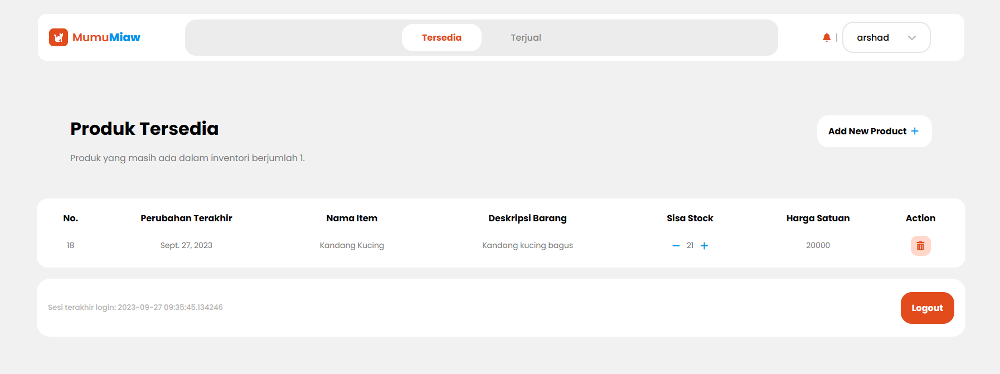
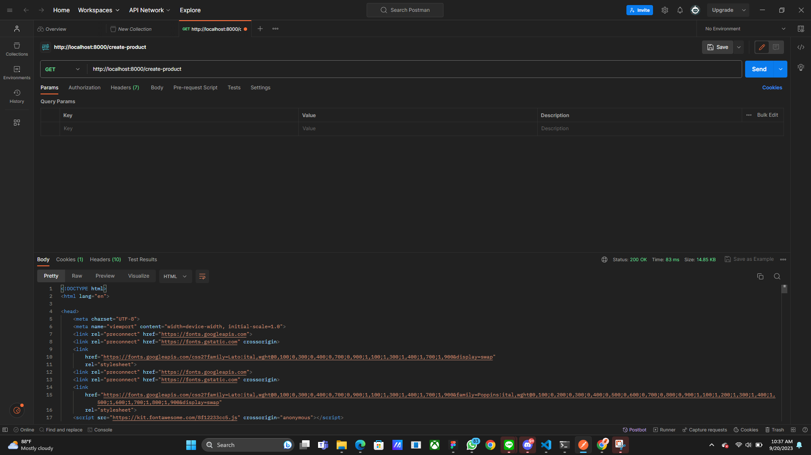

# Tugas 5


 ## Jelaskan manfaat dari setiap element selector dan kapan waktu yang tepat untuk menggunakannya.

 ### Universal Selector
 #### Universal selector bermanfaat untuk menyeleksi semua elemen dalam dokumen HTML tanpa terkecuali.
 #### Dari manfaat tersebut, penggunaan universal selector sangat jarang karena hanya untuk implementasi kondisi-kondisi umum saja seperti warna background utama.

 ### Type Selector
 #### Setiap elemen memiliki tag tertentu seperti <p> dan <a>. Type selector berguna untuk menyeleksi elemen-elemen yang menggunakan tipe tag tertentu.
 #### Type selector sangat cocok digunakan untuk membuat gaya semua elemen dari tag tertentu. Misalkan, font memiliki gaya tetap dengan jenis berbeda-beda, seperti <h1> <h2> sehingga semua elemen akan dibentuk seperti aturan tag tertentu.

 ### Class selector (`.`)
 #### Di dalam markup HTML5, biasanya masing-masing elemen ditandai dengan `class` tertentu. Misalkan `<div class="contoh"></div>`. Maka semua elemen di `contoh` akan di-select menggunakan class selector menjadi `.contoh` sehingga style atau gaya elemen pada `class` tersebut diatur serupa.
 #### Class selector dapat digunakan ketika ingin membuat gaya pada suatu kelompok elemen tertentu, misalkan `class="section-utama"` akan di-styling pada css dengan format `.section-utama`.

 ### ID Selector (`#`)
 #### ID selector memiliki kegunaan yang mirip dengan class selector. Hanya saja, ID Selector digunakaan untuk menggaya elemen tunggal yang memiliki karakteristik khusus.
 #### ID selector cocok digunakan untuk mengaplikasikan gaya pada elemen-elemen unik yang ada di dokumen HTML seperti `#nama-id`.

 ### Attribute Selector (`[attribute]`)
 #### Attribute ini akan menyeleksi elemen berdasarkan atribut tertentu tanpa memedulikan nilainya.
 #### Atribut ini dapat digunakan di berbagai situasi. Misalkan,
 ##### Gaya elemen yang mengandung nilai tertentu 
 ##### `bash [title*="promo"] {font-weight: bold;}`

 ### Pseudo-Class Selector(`:`)
 #### Bermanfaat untuk menambahkan gaya elemen pada suatu aksi.
 #### Dapat digunakan ketika terdapat aksi tertentu. Contohnya `hover` digunakan ketika kursor berada di atas suatu elemen.

 ### Pseudo-Element Selector(`::`)
 #### Jika ingin menambahkan konten sesudah maupun sebelum, selector ini cocok karena bisa memlih bagian spesifik dari elemen.
 #### Selector ini dapat digunakan ketika ingin menambahkan efek visual  ke dalam dokumen.


 ## Jelaskan HTML5 Tag yang kamu ketahui.

 ### <header>
 #### Tag ini digunakan untuk mengelompokkan elemen-elemen yang menjadi komposisi introduksi dalam suatu laman web.

 ### <nav> atau `navigation`
 #### Jika terdapat beberapa halaman dalam suatu website, maka nav bisa digunakan untuk mengelompokkan menu yang berisi halaman-halaman website.

 ### <section>
 #### Tag ini dapat mengelompokan elemen-elemen yang terjaring dalam suatu konten atau section pada laman website.

 ### <div> atau `division`
 #### Tag yang sering dijumpai untuk mengatur elemen-elemen menjadi berkelomopok dalam suatu blok

 ### <p> atau `paragraph`
 #### Tag ini berisi teks digunakan untuk menuliskan deskripsi atau menampilkan informasi bacaan dalam bentuk paragraf.

 ### <h> atau `heading`
 #### Tag ini berisi teks yang digunakan untuk membuat judul dan subjudul sebagai inti / klasifikasi konten.

 ### <span> 
 #### Tag ini digunakan untuk memisahkan teks dalam suatu paragraf yang ingin diberikkan tampilan gaya atau highlight.

 ### <table>
 #### Digunakan untuk membuat tabel
 
 ### <th>
 #### Digunakan untuk membuat satu baris yang berisi header sebagai pengelompok sel-sel di bawahnya.

 ### <tr>
 #### Digunakan untuk membuat baris pada tabel.

 ### <td>
 #### Digunakan untuk mendefinisikan isi sel-sel di bawah table head.


 ## Jelaskan perbedaan antara margin dan padding.

 #### Margin digunakan sebagai sekat yang membatasi jarak antarelemen, sedangkan padding digunakan sebagai jarak ujung-ujung di dalam elemen itu sendiri. Dalam hal ini, margin tidak memberikan warna background tambahan pada elemen, sedangkan padding terdapat warna di latar belakang elemen.


 ## Jelaskan perbedaan antara framework CSS Tailwind dan Bootstrap. Kapan sebaiknya kita menggunakan Bootstrap daripada Tailwind, dan sebaliknya?
 
 ### Tailwind
 #### Tailwind adalah framework CSS yang lebih baru daripada bootstrap yang dapat membuat rancangan tampilan.

 ### Bootstrap
 #### Bootstrap adalah framework CSS yang memberikan komponen tersistem yang sudah dibangun sebelumnya sehingga pengguna bisa pakai komponen tersebut secara langsung.

 ### Perbedaan Tailwind dan Bootstrap
 #### Tailwind memberikan kelas-kelas yang dapat digunakan untuk merancang kode HTML yang bisa membuat kustom desain dengan tampilan yang spesifik. Saat menggunakan Tailwind, pengguna perlu menulis kode dengan kelas-kelas pada HTML. 
 #### Bootstrap memberikan `templat` komponen siap saji seperti navigasi, tombol, dan kotak dialog sehingga pengguna tiddak perlu capek-capek menulis banyak kustom kode.

 ### Kapan menggunakan Booostrap atau Tailwind? 
 #### Bootstrap berguna untuk membangun website dengan proyek yang cepat tanpa perlu memikirkan pembuatan sistem desain, tetapi karena proses yang cepat dan serba jadi tersebut pengguna tidak mengostumisasi tampilan. Sedangkan Tailwind digunakan untuk merancang tampilan yang ciamik dalam projek besar. Pengguna dapat mengostumisasi komponen-komponen secara spesifik sehingga proses pengerjaannya cenderung lebih lama dibanddingkan Tailwind. Berdasarkan klasifikasi tersebut, dapat disimpulkan Bootstrap cocok digunaakan pada proyek yang cepat dan tidak butuh pembuatan desain sistem, sedangkan Tailwind sebaliknya.

 


# Tugas 4


 ## Apa itu Django UserCreationForm, dan jelaskan apa kelebihan dan kekurangannya?
 ### Pengertian
 UserCreationForm merupakan formulir templat yyang disediakan untuk berbagai keperluan pembuatan dan pengaturan akun di mana formulir ini juga dapat menerima request berupa data input dari pengguna, seperti email dan password.
 ### Kelebihan
 1. Ada verifikasi identitas yang mengharuskan pengguna memberikan bukti bahwa pengguna adalah pemilik akun yang sah bukan bot attau akun palsu.
 2. Informasi sudah terkumpul dalam templat di mana formulir ini bisa digunakan untuk membuat akun atau meliat data profil.
 3. Pengalaman lebih personal dan relevan karena pengaturan yang bisa disesuaikan.
 4. Ada pengontrolan akses ke konten berdasarkan tipe akun sehingga masing-masing tipe akun disajikan layanan sesuai personifikasi masing-masing.
 ### Kekurangan
 1.  Monoton dan membosankan. Hal ini diakibatkan form sudah tergenerate dari templat sehingga tidak bisa mengengage pengguna dalam segi simplifikasi dan estetika.
 2. Rentan serangan. Hal ini diakibatkan tidak adanya sistem pengamanan yang kuat sehingga banyak terjadi kasus bruce force attack  atau pencurian identitas.
 3. Mudah typo dan tidak gampang diingat. Hal ini diakibatkan form mengharuskan banyak syarat password sehingga pengguna mudah mengalami kesalahan dan lupa.
 4. Kurang efisien. Hal ini diakibatkan banyak persyaratan yang perlu diisi sehingga memerlukan proses lama untuk mengakses platform.


 ## Apa perbedaan antara autentikasi dan otorisasi dalam konteks Django, dan mengapa keduanya penting?
 Perbedaan mencolok dari autentikasi dan otorisasi adalah urutan prosesnya. Singkatnya, autentikasi berperan untuk pemeriksaan identitas dab otorisasi mengatur izin atau hak aksesnya. Secara lengkap, Autentikasi adalah proses memasukan etintas data pengguna untuk memastikan pengguna tersebut mendapatkan akses ke data atau sumber daya pada suatu website. Sedangkan otorisasi adalah proses lanjutan untuk menentukan data atau sumber daya apa saja yang dapat disajikan sesuai tipe akun pengguna. Keduanya saling berkaitan satu sama lain dalam proses tersebut dan sangat penting untuk mempersonalisasi akun berdasarkan tipe akun sehingga pengguna mendapatkan informasi-informasi yang hanya ia butuhkan saja.


 ## Apa itu cookies dalam konteks aplikasi web, dan bagaimana Django menggunakan cookies untuk mengelola data sesi pengguna?
Dalam aplikasi web, cookiees merupakan data atau file berukuran kecil yang ada ketika pengguna mengunjungi suatu website dan menyimpan data riwayat pengguna tersebut. Dalam konteks Django, cookies digunakan untuk mengeola data sesi pengguna. Inforasi data diri spesifik masing-masing pengguna disimpan di `user session`. Prosesnya, pengguna mengakses suatu tautan website, lalu cookies menyimpan ID unik yang dikirimkan ke browser pengguna. Informasi sesi pengguna itu berkaitan dengan permintaan pengguna untuk masuk ke lingkungan sistem di mana dalam hal ini Django memiliki mekanisme untuk menyimpan dan mengeola data sesi secara aman. Dari situ, Django menyediakan API yang memungkinkan pengguna berinteraksi dalam website seperti inventori yang memungkinkan pengguna mendapat data daftar produk yang tersimpan hingga informasi sesi terakhir kali login. Lalu, cookies ini biasanya tersimpan dalam jangka waktu tertentu sehingga pengguna yang tidak dalam lingkungan siste dalam waktu tertentu otomatis terlogout.


 ## Apakah penggunaan cookies aman secara default dalam pengembangan web, atau apakah ada risiko potensial yang harus diwaspadai?
 Tidak selalu aman. Jika coockies tidak dienkripsi, maka rentan terhadap serangan pencurian informasi data, terlebih cookies yang mengandung token otentikasi masuk pengguna. Untuk itu, pastikan cookies dienkripsi terutama pada informasi sensitif. Penggunaan HTTPSOnluy dan secure flags mencegah akses melalui js, sementara secure memastikan cookies hanya dikirim melalui koneksi HTTPS. Resiko potensial yang patut diwaspadai antara lain serangan XSS yang dapat memanipulasi cookies pengguna, CSRF yang dapat mengirimkan permintaan yang tidak diinginkan pengguna, serta penyerangan lainnya.
 
 

 ## Jelaskan bagaimana cara kamu mengimplementasikan checklist di atas secara step-by-step (bukan hanya sekadar mengikuti tutorial).

 ### Mengimplementasikan fungsi registrasi, login, dan logout untuk memungkinkan pengguna untuk mengakses aplikasi sebelumnya dengan lancar.

   Pertama-tama saya mencoba mengimplementasikan fungsi register. Saya tidak membuat fungsi dari awal, melainkan dengan mengimpor formulir bawaan sehingga lebih cepat.
   ```bash
   form = UserCreationForm();
   ```

   ```bash
   from django.shortcuts import redirect
   from django.contrib.auth.forms import UserCreationForm
   from django.contrib import messages  ```

   Saya menggunakan metode `HTTP POST` sehingga data yang diinput pengguna masuk ke dalam `request.POST`. Lalu, data dicek dan divalidasi untuk memastikan apakah data bisa disimpan atau tidak. Ketika syarat pengisian form terisi dengan benar, maka akan muncul pesan sukses. Setelah berhasil mendaftar, laman terredirect ke laman login untuk masuk ke akun yang baru saja dibuat.
   
   ```bash
   def register(request):
    form = UserCreationForm()

    if request.method == "POST":
        form = UserCreationForm(request.POST)
        if form.is_valid():
            form.save()
            messages.success(request, 'Your account has been successfully created!')
            return redirect('main:login')
    context = {'form':form}
    return render(request, 'register.html', context)
   ```

   Lalu, untuk menyajikan data yang sudah disimpan di fungsi register akan ditampilkan di dalam berkas templates. Oleh karena itu, saya mencoba mengintegrasikan keduanya.
   ```bash
      

         
            <title>Register</title>
         

           

         <div class = "login">
         
         <h1>Register</h1>  

            <form method="POST" >  
                    
                  <table>  
                     {{ form.as_table }}  
                     <tr>  
                        <td></td>
                        <td><input type="submit" name="submit" value="Daftar"/></td>  
                     </tr>  
                  </table>  
            </form>

           
            <ul>   
                    
                     <li>{{ message }}</li>  
                       
            </ul>   
         

      </div>  

      
   ```

   Beralih ke laman login, sama seperti register, saya tidak membuat fungsi login dari awal, melainkan mengimport fungsi autentikasi yang tersedia dalam bentuk templat
   ```bash
   from django.contrib.auth import authenticate, login
   ```
   ```bash
   def login_user(request):
    if request.method == 'POST':
        username = request.POST.get('username')
        password = request.POST.get('password')
        user = authenticate(request, username=username, password=password)
        if user is not None:
            login(request, user)
            return redirect('main:show_main')
        else:
            messages.info(request, 'Sorry, incorrect username or password. Please try again.')
    context = {}
    return render(request, 'login.html', context)
   ```
   Lalu, agar pengguna harus melakukan login agar bisa ke laman inventori, saya menambahkan akses halaman terestriksi pada bagian atas fungsi `show_main`
   ```bash
   @login_required(login_url='/login')
   def show_main(request):
   ```
   Hasil `request.POST` pengguna divalidasi kembali juga dan mengecek apakah ada pengguna di dalam database atau tidak. Jika tidak, terdapat notifikasi gagal.
   ```bash
      

      
         <title>Login</title>
      

      

      <div class = "login">

         <h1>Login</h1>

         <form method="POST" action="">
            
            <table>
                  <tr>
                     <td>Username: </td>
                     <td><input type="text" name="username" placeholder="Username" class="form-control"></td>
                  </tr>
                        
                  <tr>
                     <td>Password: </td>
                     <td><input type="password" name="password" placeholder="Password" class="form-control"></td>
                  </tr>

                  <tr>
                     <td></td>
                     <td><input class="btn login_btn" type="submit" value="Login"></td>
                  </tr>
            </table>
         </form>

         
            <ul>
                  
                     <li>{{ message }}</li>
                  
            </ul>
              
            
         Don't have an account yet? <a href="">Register Now</a>

      </div>

      
   ```
   Begitupula dengan logout. Jika pengguna melakukan request untuk logout, maka site akan dikembalikan menuju laman login.
   ```bash
   def logout_user(request):
    logout(request)
    return redirect('main:login')
   ```
   Pada urls,py saya mengimpor fungsi yang sudah didefinisikan dalam views.
   ```bash
   from main.views import logout_user
   ```
   beserta routing pathnya
   ```bash
   path('logout/', logout_user, name='logout'),
   ```
   Data logout tersimpan sebagai data pengguna login untuk terakhir kalinya. Hal ini saya lakukan dengan memperbarui kondisional pada `if user is not None` dengan mengatur cookie terakhir kali login bersarakan waktu pengguna logout.
   ```bash
   response = HttpResponseRedirect(reverse("main:show_main"))
   response.set_cookie('last_login', str(datetime.datetime.now()))
   ``` 
   Kegunaan HttpResponseRedirect di sini adalah mengarahkan ke show_main. Akan tetapi, last login belum bisa ditampilkan di website, oleh karena itu harus menambahkan `last_login` pada `context` dan ubah `struktur_html`
   ```bash
   context = {
    'name': 'Pak Bepe',
    'class': 'PBP A',
    'products': products,
    'last_login': request.COOKIES['last_login'],
   }
   <h5>Sesi terakhir login: {{ last_login }}</h5>
   ```

 ### Membuat dua akun pengguna dengan masing-masing tiga dummy data menggunakan model yang telah dibuat pada aplikasi sebelumnya untuk setiap akun di lokal.
 Pertama-tama, saya memastikan sudah terkoneksi dengan host lokal dengan mengaktifkan virtual environment dan menjalankan server di host lokal
 ```bash
 env\Scripts\activate.bat
 py manage.py runserver
 ```
 Kemudian, saya memasukkan data inputan pada laman login yang terpampang pada aplikasi utama karena pengguna tidak bisa langsung mengakses inventori.


 ### Menghubungkan model Item dengan User.
   Karena masing-masing pengguna memiliki database produk berbeda-beda, maka pada model Product perlu ditambahkan `user`
   ```bash
   class Product(models.Model):
    user = models.ForeignKey(User, on_delete=models.CASCADE)
   ```
   
   
   

 ### Menampilkan detail informasi pengguna yang sedang logged in seperti username dan menerapkan cookies seperti last login pada halaman utama aplikasi.
Saya mmenampilkan informasi user yang sedang login pada navigation bar di `main.html` dengan kode berikut
```bash

            <div class="profile">
                <p class="user">{{ name }}</p>
                <i id="chevron" class="fa-solid fa-chevron-down" style="color: #b4b4b4; background-color: white;"></i>
            </div>
```
sedangkan aktivitas login terakhir ditampilan berdampingan dengan button logout
```bash
<a href="" style="background-color: #ffffff;">
   <button style="background-color: #e24c1d; color: #ffffff;">
         Logout
   </button>
</a>
                    
```

=======================================================================================================================================================================

# Tugas 3


[x] Membuat input form untuk menambahkan objek model pada app sebelumnya.

[x] Tambahkan 5 fungsi views untuk melihat objek yang sudah ditambahkan dalam format HTML, XML, JSON, XML by ID, dan JSON by ID.

[x] Membuat routing URL untuk masing-masing views yang telah ditambahkan pada poin 2.

[x] Menjawab beberapa pertanyaan berikut pada README.md pada root folder.

 ## Apa perbedaan antara form POST dan form GET dalam Django?
      - GET biasanya digunakan untuk pengiriman data yang tidak sensitif, seperti query pencarian. 
      Sedangkan POST, biasanya digunakan untuk data yang membutuhkan keamanan tingkat tinggi, seperti username dan password.
      - GET mengirimkan data melalui URL lalu disimpan ke action, 
      sedangkan POST langsung mengirimkan data ke action untuk ditampung tanpa melalui URL
      - GET tidak boleh melebihi 2047 karakter, 
      sedangkan POST tidak tebatas
      - GET dapat meningkatkan efisiensi karena dapat dicache oleh server, 
      sedangkan POST memerlukan request baru


## Apa perbedaan utama antara XML, JSON, dan HTML dalam konteks pengiriman data?
      Dalam proses pengiriman data, JSON memiliki objek yang terdiri dari pasangan key-value di mana masing-masing objek memiliki key unik untuk mengakses value. 
      Sedangkan untuk HTML dan XML menggunakan konsep hierarki struktur pohon di mana elemen lain dapat membentuk elemen bersarang di dalam suatu elemen. 
      Antara HTML dan XML banyak menggunakan penandaan tag. Namun, perbedaan yang mencolok dari HTML dan XML terletak pada fungsionalitasnya. 
      HTML menampilkan data ke dalam bentuk konten (mengatur kerangka struktur web) dengan tujuan berbeda-beda, seperti img untuk menampilkan data dan tag a untuk mengalirkan ke suatu tautan. 
      Sedangkan XML, tag digunakan sebagai penandaan / identitas suatu nilai yang memiliki fungsi serupa dengan XML. 
      Walaupun HTML berfokus dalam pembuatan skeleton website, di HTML juga terdapat form yang dapat berperan sebagai pertukaran data.

## Mengapa JSON sering digunakan dalam pertukaran data antara aplikasi web modern?
      JSON memiliki sintaks yang mudah dipahami dan sajian datanya memiliki kemiripan dengan bahasa yang serupa seperti Python, Java, dan Java Script. Salah satu hal yang serupa dilakukan di JSON adalah bisa melakukan penyimpanan struktur data yang kompleks menggunakan array. Dalam melakukan parsing, JSON tidak memiliki cara khusus karena hanya tinggal mengimplementasikan dari javascript. Efisiensi tinggi yang dimiliki JSON juga menajdi keunggulan. Dalam hal ini, JSON mengurangi beban jaringan saat transfer data dan klien karena tidak memerlukan ukuran file yang besar.

## Jelaskan bagaimana cara kamu mengimplementasikan checklist di atas secara step-by-step (bukan hanya sekadar mengikuti tutorial).

### Migrate Ulang
   Saya melakukan migrasi ulang karena terdapat kesalahan no amount in list dengan menggunakan command di mana saat melakukan itu saya set angka 1 pada base value.
   ```bash
   py manage.py makemigrations
   py manage.py migrate
   ```
### Mengubah routing ke `/`
Di file `urls.py`, saya melakukan pengubahan routing dari `main/` menjadi `/`.

### Membuat folder base untuk kerangka HTML dan mengatur `settings.py`
Saya melakukan penambahan berkas `base.html` ke dalam direktori templates untuk membuat formatting kerangka HTML. Lalu, setelah itu saya mencoba mengatur berkas main.html mana saja yang perlu dihapus dari file tugas2 sebelumnya. Agar berkas base.html terdeteksi, saya menambahkan
```bash
TEMPLATES = [
    {
        'BACKEND': 'django.template.backends.django.DjangoTemplates',
        'DIRS': [BASE_DIR / 'templates'], # Tambahkan kode ini
        'APP_DIRS': True,
       
    }
]
```
ke dalam file `settings.py`.

### Membuat Form Data Produk
Di file sebelumnya, saya melakukan input manual untuk data produk. Pada tugas ini, saya membuat berkas `forms.py` untuk menginisiasi data models yang ada di Product. Setelah itu saya menambahkan beberapa import di dalam `view.py`.
```bash
from django.http import HttpResponseRedirect
from main.forms import ProductForm
from django.urls import reverse
```

### Terima request form
Agar form bisa diakses, perlu suatu parameter yang menerima submit dari form. Saya menginisiasi fungsi `create_product` agar bisa memvalidasi isi input dan menyimpannya.

### Ubah show_main
Karena produk-produk diinisiasi secara otomatis, saya mencoba menghapus key dari dict context. Lalu, untuk data produk yang diisi manual saya inisiasi kembali dengan membuat suatu objek yang dapat mengambil object Produk.

### Membuat akses add produk
Agar produk bisa ditambahkan secara iteratif, saya membuat file `create_product.html` dan mengedit `urls.py` untuk menambahkan import serta path.

### XML
Untuk menampilkan data dalam format XML, saya membuat sebuah fungsi di dalam file `views.py` yang terletak di dalam folder `main`. Fungsi ini diberi nama `show_xml` sesuai dengan tugas yang diberikan. Fungsi `show_xml` ini akan menerima parameter request dan akan mengambil semua data dari objek Product dan menyimpannya dalam sebuah variabel. Data ini akan diubah menjadi format XML menggunakan `serializers` dan akan dikirim kembali kepada pengguna dalam bentuk respons `HttpResponse`. Agar fungsi ini dapat berjalan dengan baik, kita perlu menambahkan impor `serializers` dan `HttpResponse` dari modul Django. Selanjutnya, untuk menampilkan data berdasarkan ID, kita akan membuat sebuah fungsi baru yang diberi nama `show_xml_by_id`. Fungsi ini akan memiliki fungsionalitas yang serupa dengan fungsi sebelumnya, tetapi dengan penambahan parameter id.

Setelah selesai membuat kedua fungsi tersebut, saya perlu mengimpor keduanya ke dalam file `urls.py` yang terletak di dalam folder `main`. Selanjutnya, tambahkan dua path yaitu `path('xml/', show_xml``, name='show_xml')` dan `path('xml/<int:id>/'``, show_xml_by_id, name='show_xml_by_id')` ke dalam daftar `urlpatterns`. Dengan demikian, kita akan dapat melihat data dalam bentuk XML melalui tautan `http://localhost:8000/xml` dan `http://localhost:8000/xml/[id]` untuk melihat hasilnya.

### JSON
   Dalam hal ini, saya menginginkan projek bisa diakses dalam format JSON. Oleh karena itu, hal yang saya lakukan adalah membuat fungsi yang menerima parameter `show_json_id`. Kemudian, di dalam file `urls.py` saya menambahkan path `path('json/', show_json, name='show_json'),` dan `path('json/<int:id>/', show_json_by_id, name='show_json_by_id'),` ke dalam list `urlpatterns`. Kemudian, saya mengecek hasil melalui `http://localhost:8000/json` ataupun `http://localhost:8000/json/1`

[x] Mengakses kelima URL di poin 2 menggunakan Postman, membuat screenshot dari hasil akses URL pada Postman, dan menambahkannya ke dalam README.md.





[x] Melakukan add-commit-push ke GitHub.
   Sebelum push, saya mendapatkan masalah file bentrok di file head dan hal yang saya lakukan melakukan 
   ```bash
   git checkout main
   ```
   Lalu, melakukan merge dengan branch selain main.
   ```bash
   git merge task3
   ```
   Di terminal, saya melakukan tahap akhir yaitu mem-push semua perubahan.
   ```bash
   git add .
   git commit -m "pesan"
   git push -u origin main
   ```


=======================================================================================================================================================================

Tugas 2

https://task2inventory.adaptable.app

1. Langkah membuat proyek Inventori Alat dan Produk untuk Kucing:

A. Menuju ke terminal / cmd:
   - Melihat posisi direktori saat ini dengan command: `pwd`
   - Menuju tempat penyimpanan folder yang diinginkan berdasarkan posisi direktori dengan command: `cd`
   - Membuat direktori baru di dalam direktori tujuan dengan command: `mkdir task2_inventori`

B. Membuat/mengaktivasi virtual environment:
   - Aktivasi dilakukan untuk mengisolasi dependensi spesifik dengan versi paket Python yang sesuai.
   - Membuat VE dengan command: `python -m venv env` dan mengaktivasi dengan command: `env\Scripts\activate.bat`

C. Instalasi Django:
   - Melakukan instalasi dependencies dengan perintah `pip install -r requirements.txt`

D. Membuat proyek Django:
   - Proyek Django dibuat dengan perintah `django-admin startproject task2_inventori`

E. Menjalankan server pengembangan lokal:
   - Menambahkan perizinan akses ke semua dengan menginput `*` pada `ALLOWED_HOST` di `settings.py` dalam direktori proyek `task2_inventori`.
   - Perintah `python manage.py runserver` digunakan dalam kerangka kerja Django untuk menjalankan server pengembangan lokal.

F. Membuat aplikasi "main":
   - Perintah `python manage.py startapp main` dalam kerangka kerja Django digunakan untuk membuat sebuah "app" baru dalam proyek Django.

G. Merouting URL ke app "main":
   - Di direktori `task2_inventori`, dilakukan penambahan routing ke file `urls.py` sehingga proses yang direquest dari URL utama akan diteruskan ke "main".

H. Membuat model "Item":
   - Model "Item" didefinisikan dalam file `models.py` di aplikasi "main". Model ini mendefinisikan atribut seperti name, amount, description, dan price.

I. Mengatur logika aplikasi dengan membuat `views.py`:
   - Untuk mengatur logika aplikasi, dibuat fungsi "items" dalam file `views.py` di aplikasi "main". Fungsi ini akan mengambil data dari model "Item" dan merendernya ke dalam template HTML.

J. Membuat routing untuk fungsi:
   - Routing untuk fungsi yang telah dibuat di file `views.py` dalam `urls.py` dilakukan untuk mengatur cara HTTP mencapai fungsi yang sesuai di aplikasi "main" saat mengakses URL tertentu.

K. Membuat template implementasi HTML:
   - Dalam tahap implementasi HTML template, menciptakan template HTML di dalam direktori baru dalam aplikasi "main". Template ini berfungsi untuk mengelola tampilan halaman web yang akan ditampilkan kepada pengguna. Data yang diperoleh dari `views.py` akan dimasukkan ke dalam template ini.

L. Uji proyek Django dengan test:
   - Untuk menguji proyek Django, melakukan pengujian dengan membuat unit test dan `TestCase` menggunakan model-model dari proyek `task2_inventori`. Langkah ini bertujuan untuk menguji atribut-atribut yang ada dalam proyek.

M. Add, commit, hingga push ke repository:
   - Setelah berhasil melakukan pengujian, langkah selanjutnya adalah meng-add, meng-commit, dan meng-push proyek ke repositori GitHub "Library-Inventory". Sebelum melakukan pengunggahan, juga membuat file `.gitignore` untuk menentukan berkas dan direktori yang tidak perlu disertakan dalam repositori Git. Setelah itu, dilakukan tahap menambahkan (add), meng-commit, dan meng-push ke repositori GitHub.

N. Deploy ke Adaptable:
   - Selanjutnya, proyek di-deploy ke Adaptable setelah selesai dikembangkan secara lokal. Hal ini memungkinkan aplikasi dapat diakses secara online oleh orang lain melalui internet.

O. Menjawab pertanyaan dan mengumpulkan berkas pengumpulan:
   - Setelah seluruh tahap selesai, membuat file README.md yang berisi tautan ke aplikasi di Adaptable dan menjawab pertanyaan yang terkait dengan proyek aplikasi ini. Kemudian, kembali melakukan tahap menambahkan (add), meng-commit, dan meng-push file README.md ke repositori GitHub.

P. Menutup virtual environment:
   - Terakhir, setelah semua tahap selesai, melakukan perintah "deactivate" pada virtual environment karena sudah tidak lagi diperlukan.


2. Bagan request client yang berkaitan dengan urls.py, views.py, models.py, dan berkas lain.

        **Client's Web Browser**
                    |
                    v
        **Django Web Application**
                    |
                    v
    **urls.py** <-------->  **views.py**
        |                 |
        v                 v
    **models.py**   **items.html**

Penjelasan:
* Client's Web Browser: Sebuah permintaan dimulai dari web browser pengguna atau client saat mereka memasukkan URL atau mengklik tautan.
* Django Web Application: Permintaan tersebut kemudian diterima oleh aplikasi web berbasis Django, yang akan memprosesnya dan mengirimkan respons kembali ke client.
* urls.py: File urls.py bertanggung jawab untuk menentukan bagaimana permintaan URL akan diarahkan dan menghubungkan URL yang diterima dari client dengan fungsi tindakan yang sesuai di dalam views.py.
* views.py: Ketika permintaan URL diteruskan oleh urls.py, views.py mengambil alih untuk memproses permintaan tersebut. views.py dapat mengakses model untuk memproses data dan merender items.html atau mengembalikan respons JSON, tergantung pada kasus penggunaan.
* models.py: File models.py menggambarkan struktur data dalam aplikasi dan memberikan definisi model yang digunakan untuk berinteraksi dengan database atau data lainnya. models.py dapat digunakan oleh views.py untuk mengambil atau menyimpan data.
* items.html: items.html digunakan untuk mengatur tampilan yang akan diberikan kepada pengguna atau client. views.py dapat merender items.html dengan data yang diambil dari model dan kemudian mengirimkannya kembali ke client sebagai respons HTML yang siap ditampilkan.


3. Mengapa virtual environment penting dalam pengembangan python
Virtual environment (lingkungan virtual) adalah alat yang krusial dalam pengembangan Python yang diciptakan untuk mengisolasi dan mengelola dependensi serta paket Python untuk setiap proyek. Hal ini menyebabkan proyek tidak mengalami tumpang tindih / konflik dengan penggunaan package dan dependensi yang spesifik. Tanpa adanya virtual environment, pengelolaan terhadap versi versi python yang ada menjadi sulit serta pengisolasian dependensi proyek yang berbeda lebih rumit. 


4. MVVM, MVT, dan MVC

A. MVVM dan Kerangka Kerja JavaScript:
* MVVM adalah pola arsitektur yang umumnya digunakan dalam pengembangan aplikasi berbasis kerangka kerja JavaScript, seperti Angular, Vue.js, dan Knockout.js.
* MVVM sangat cocok untuk mengembangkan aplikasi berbasis klien (client-side) di mana tampilan (View) sering berinteraksi secara dinamis dengan data yang berubah (Model).
* Dalam MVVM, ViewModel berperan sebagai perantara antara Model (data) dan tampilan (UI). Ini memungkinkan tampilan untuk berinteraksi dengan data melalui ViewModel tanpa perlu tahu secara langsung tentang Model.
B. MVC/MVT dan Pengembangan Server-Side:
* MVC (Model-View-Controller) dan MVT (Model-View-Template) adalah pola arsitektur yang umumnya digunakan dalam pengembangan server-side, seperti dalam kerangka kerja web seperti Django (Python) dan Ruby on Rails (Ruby).
* MVC/MVT adalah pendekatan yang baik untuk mengatur kode server dan mengelola permintaan HTTP serta respons yang diberikan oleh server.
* Model digunakan untuk mengelola data dan interaksi dengan database, View atau Template digunakan untuk menghasilkan tampilan HTML, dan Controller digunakan untuk mengatur logika aplikasi.
C. Pemisahan Logika Tampilan:
* MVVM cenderung lebih memisahkan logika tampilan dari Model dibandingkan dengan MVC/MVT. Ini karena ViewModel mengambil tanggung jawab untuk mengelola logika presentasi, sehingga tampilan (View) hanya bertanggung jawab untuk menampilkan data yang diberikan oleh ViewModel.
* Dalam MVC/MVT, logika tampilan biasanya lebih dekat terkait dengan Model dan Controller/View yang bertindak sebagai perantara untuk mengambil data dari Model dan mengirimkannya ke tampilan (View/Template).
D. Tampilan Data-Binding:
* MVVM sering menggunakan teknik data-binding yang kuat, yang memungkinkan perubahan dalam Model secara otomatis diteruskan ke tampilan (View) tanpa perlu memperbarui tampilan secara manual.
* Dalam MVC/MVT, perubahan dalam Model biasanya memerlukan upaya tambahan untuk mengirim ulang data ke tampilan.
Kesimpulannya, MVVM adalah pola arsitektur yang lebih umumnya digunakan dalam pengembangan aplikasi berbasis kerangka kerja JavaScript dan memiliki pemisahan logika tampilan yang lebih ketat dari Model. Sementara itu, MVC/MVT adalah pendekatan yang umumnya digunakan dalam pengembangan server-side seperti Django, di mana tampilan, model, dan controller/templating berperan dalam mengelola komponen aplikasi secara terpusat. Pilihan antara keduanya akan bergantung pada konteks pengembangan dan teknologi yang digunakan.
https://docs.djangoproject.com/en/3.2/intro/tutorial01/#creating-the-poll-app
